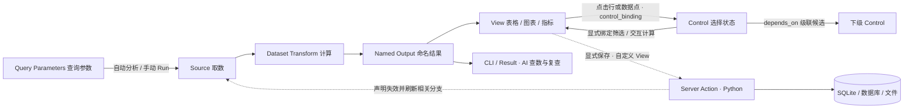

# Dataviz

让 AI 用 SQL、Python 和 YAML 构建可查询、可联动、可标注的数据看板；也能通过 CLI 搜索已有口径、查数和复用结果。

从一个 YAML 起步，复杂时再组织为多页面 Dashboard 或 Workspace。配置与代码都是普通文件，可纳入 Git；无需从零编写前端。

## 组件怎样联动？



取数不需要预处理时，Source 的 Output 可直接接 View。**本地单文件打开即分析，改参数或文件无需 Run、无需重启；昂贵计算用 `--execution manual`。** 外部连接默认手动；Control 用于查询后的交互，不自动重跑整套查询。

## 给 AI 的关键词

| 关键词 | 告诉 AI 什么 |
| --- | --- |
| **Query Parameter** | “日期、模型是查询参数，点击 Run 后重新取数。” |
| **Dashboard → Page → Section → View** | 看板 → 可选分析页 → 分区 → 表格/图表。简单看板不必声明 Page 或 Section；多页可各有参数和结果。 |
| **Dashboard / Section / View Control** | 页面全局、分区内、单个视图的选择状态；作用对象通过依赖与绑定声明，不是自动过滤所有图。 |
| **级联 · `depends_on`** | “省份 → 城市 → 门店”，父级选择改变下级候选；用 select、multiple select 或 cascader 展示。 |
| **点选联动 · `control_binding`** | 表格行或支持选择事件的图表更新 Control，其他 View 订阅它显示详情；不是图表间直接互相修改。 |
| **Source / Transform / Named Output** | 从哪里取数、怎样计算、结果叫什么；多个 View 可以消费同一结果。 |
| **Server Action** | 显式调用服务端 Python 做新增、修改、删除或业务计算；自定义表格按钮可用于人工标注，保存后局部刷新。 |
| **Adapter / auth** | 连接与凭据放在看板之外；不是网站用户登录系统。 |
| **Catalog / Result** | AI 搜索已有口径；执行后封存结果，后续检查、分页、导出不必重新查库。 |

例如这样描述需求，而不必先会写 DSL：

> 日期用 Query Parameter；品类用 Dashboard Control，商品用 Section Control 并级联品类。左表点选商品绑定 Control，右图跟随；切换商品不重查销售库。

> 自定义商品表增加“敏感 / 非敏感”互斥标注，通过 Server Action 按商品＋节日写入 SQLite；保存后只刷新标注数据，分别显示保存与刷新状态。

> 一个 Dashboard 两个 Page：同年跨品类、同品类跨年，各有查询参数，共用看板内 Python 规则。

## 两种起步方式

Python 3.11–3.14，推荐 3.12。从本地发行 wheel 安装（当前 **0.26.0**，包含配套 Skill）：

```bash
python -m pip install ./ai_dataviz-0.26.0-py3-none-any.whl
dataviz scaffold standalone --id sales --output ./sales
dataviz validate ./sales/dashboard.yaml --strict
dataviz serve ./sales/dashboard.yaml --port 8080
```

打开 <http://127.0.0.1:8080>。这个单文件样例自带假数据，不需要数据库；支持内嵌 SQL / Python / JS 和少量自定义 Renderer。修改后重启服务。

已有本地数据？先 `dataviz inspect data sales.csv`（SQLite 可加 `--table sales`），再用 `--data sales=./sales.csv` 绑定 YAML 中的命名 Source；SQLite 同样支持，无需 auth。见 [CSV 联动示例](examples/local-csv/) / [SQLite 查询示例](examples/local-sqlite/) 和 `dataviz docs local-data`。

单文件或独立 Dashboard 文件夹的运行状态放在用户级目录，不污染输入目录；命令返回实际位置。需要 HTML 时用 `dataviz report analysis.yaml --data sales=./sales.csv --output report.html`。导出旧 Result 用其返回的原快照路径，不重新计算。

远程 SQL 或可变标注资源才需要 `--auth connections.yaml`；也可指定 auth 目录或已有 Workspace，复用其 Adapter 配置，凭据不进入快照。代码长了先拆到 `dashboard.yaml` 同目录，无需 Workspace；Page 用于同一主题的多条分析路径。

需要管理多个看板、共享静态资源或热更新时：

```bash
dataviz init myworkspace
dataviz serve myworkspace --port 8080
```

## 让 AI 按需读文档

```bash
dataviz docs --task minimal --format json
dataviz docs --search '级联' --format json
dataviz docs server-actions --format json
dataviz catalog search myworkspace '收入'
```

[配套 Skill](dataviz-skill.md) 指导 AI 按需查契约、开发、校验和分析。安装包内全文可读取后保存到 AI 工具要求的 `dataviz/SKILL.md`；不会自动覆盖已有 Skill：

```bash
python -c "from importlib.resources import files; print(files('dataviz').joinpath('skills/dataviz/SKILL.md').read_text(encoding='utf-8'))"
```

[样例](examples/) · [渐进式开发](docs/progressive-authoring.md) · [AI 查数与结果复用](docs/analysis-plane.md) · [写入与标注](docs/server-actions.md) · [源码安装与发布](docs/versioning-and-release.md) · [Changelog](CHANGELOG.md)

**使用边界：** 导出的 HTML 可保留浏览器交互，但不能执行服务端 Python 或写入；写入超时不代表回滚，应查原请求回执。Server 默认本地使用、无内建账号体系，只运行可信代码，远程访问需外部访问控制。当前 `0.x` 仅接受现行 Schema。

**许可：** [MIT](LICENSE)，允许商用、修改和再分发，须保留版权与许可声明。第三方组件遵循各自许可证。
